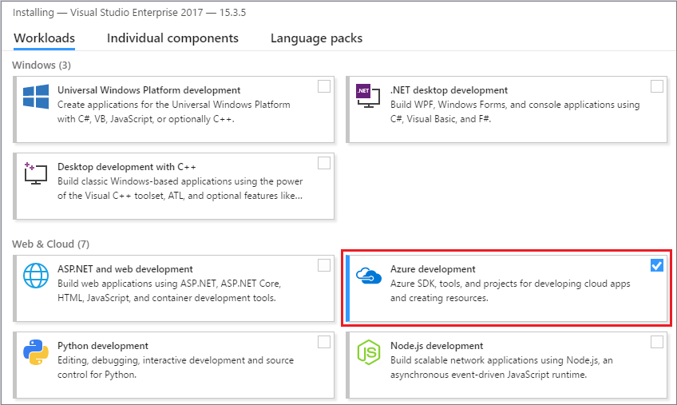

# Highly Available Storage Applications

In this lab, you learn how to make your application data highly available in Azure using RA-GRS storage

  
## Task 1 - Install Visual Studio and Azure Storage Explorer

We will use Visual Studio to run a mock console application that will copy files to Azure storage and check to see if the file was successfully copied to the primary storage account and the geo-replicated secondary storage account.  You will use Azure Storage Explorer to browse your storage accounts and verify the files were uploaded successfully.  

1. Download and install the appropriate version of [Visual Studio 2019 - Community](https://visualstudio.microsoft.com/downloads/)
2. Once the installation starts, you will be asked which workloads you would like to install.  Please select **Azure development** and complete the rest of the install using the default options for all remaining screens.

   *Note: If you receive an error stating another package is currently being installed, you will need to reboot your machine and then retry the installation.*

    

3. Download and install [Azure Storage Explorer](https://go.microsoft.com/fwlink/?LinkId=708343&clcid=0x409)
4. Accept all defaults for the **Azure Storage Explorer** install

  

## Task 2 - Create a Storage Account

1. Within the Azure Portal, *select **Create a resource*** button found on the upper left-hand corner of the Azure portal
2. *Select **Storage*** from the **New** page
3. *Select **Storage Account***
4. Fill out the storage account form with the following information:
   - Resource Group: **Create New**, Name: **RG-LAB-STORAGE**
   - Storage Account Name: **samyapp1**
   - Location: **EastUS**
   - Performance: **Standard**
   - Account Kind: **StorageV2 (general purpose v2)**
   - Replication: **Read-access geo-redundant storage (RA-GRS)**
   - Access tier (default): **Hot**

5. *Select **Review + create***
6. *Click **Create**

  

## Task 3 - Download the Console Application 

1. Download the sample project from Git Hub [storage-dotnet-circuit-breaker-pattern-ha-apps-using-ra-grs.zip](https://github.com/Azure-Samples/storage-dotnet-circuit-breaker-pattern-ha-apps-using-ra-grs/archive/master.zip)
2. Extract the **storage-dotnet-circuit-breaker-pattern-ha-apps-using-ra-grs.zip** to your local downloands folder

  

## Task 4 - Open the App Solution and Modify the Connection Strings

In this task you will load the application's solution, install the missing dependencies and add the connection string so the application can connect to the new storage account you created in Task 2.

1. Browse to the unzipped folder and open **CircuitBreaker.sln** in Visual Studio
2. Install any missing dependcies and packages if prompted
3. Next we need to configure the connection string by grabbing it from the Azure Portal.  To do that, perform the following steps:
   - In the Azure portal, navigate to your storage account **samyapp1**
   - Select **Access keys** under **Settings**
   - *Copy the **Connection String*** from either the primary or secondary key.
4. Now let's load the connection string and save it as an environment variable so the console application can use it.
   - Within Visual Studio browse to **Tools > Command Line > Developer Command Prompt** and type in the following command:

     `setx storageconnectionstring <your connection string from the portal>`

  

## Task 5 - Run the Console Application
Before we run the console application within Visual Studio, let's connect to your newly created storage account **samyapp1** using *Azure Storage Explorer* to verify we can connect and see that no data exists yet within the storage account, except for the default tables.

1. Open **Azure Storage Explorer** and connect to Azure using your Microsoft Account
2. Expand your Azure subscription and then **Storage Accounts**
3. Find storage account **samyapp1** and expand it and then expand **blob containers**; you should not have any *blob containers* created yet.
4. Now let's go back to Visual Studio and run the console application by **pressing F5** or selecting Start to begin debugging the application. 

   A console window launches and the application begins running. The application uploads the HelloWorld.png image from the solution to the **samyapp1** storage account. The application checks to ensure the image has replicated to the secondary RA-GRS endpoint. It then begins downloading the image up to 999 times. Each read is represented by a P or an S. Where P represents the primary endpoint and S represents the secondary endpoint.

   

5. Once all 999 download attempts complete, **do not** press *enter* and leave the console application running.
6. Go back to **Azure Storage Explorer** and *right-click **blob containers*** and *click **refresh***
7. You should now have a new blob container created.  Select it and verify the **HelloWorld.png** file was uploaded to your blob storage
8. Switch back to the console applicaiton and *press **enter*** to have it clean-up and remove HelloWorld.png and the blob container.
9. Go back to **Azure Storage Explorer** and *right-click **blob containers*** and *click **refresh***
10. You should no longer see the blob container 

